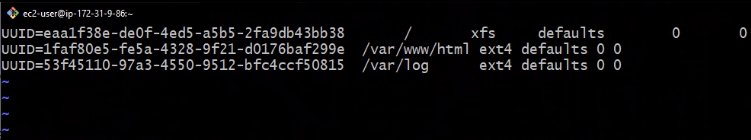
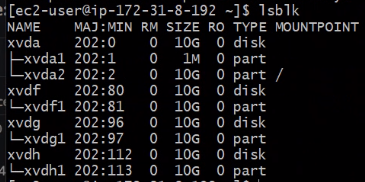
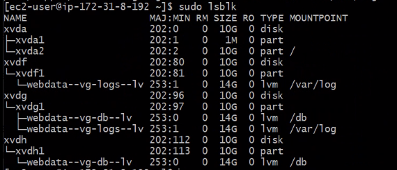
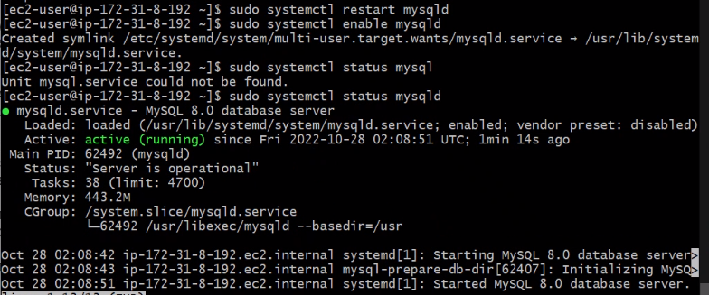

# WEB SOLUTION WITH WORDPRESS

## PROJECT BRIEF
This project involves the preparation of storage infrastructure on two Linux servers and the implementation of basic web solution using Wordpress.
The process involves 2 major phases:
* Configuring storage subsystem for Web server and Database server based on Linux OS.

* Installing WORDPRESS and connecting it to a remote MYSQL database server.

### STORAGE SYSTEM CONFIGURATION

#### WEB SERVER STORAGE CONFIGURATION
I created an EC2 instance using the RedHat Operating System and named it **webserver** and created 3 volumes each of 10 gigabytes, all witihin the same Avaialability zone. These 3 volumes were mounted on the **webserver** and named: xvdf, xvdg and xvdh.


I created a single partition on each of the 3 disk volumes using
```bash
    sudo gdisk /dev/xvdf
    sudo gdisk /dev/xvdg
    sudo gdisk /dev/xvdh
```
and in each case created a partition by typing 'n', checked the partition by typing the 'p' command and writing the partitions using the 'w' command.


I ran 
```bash
lsblk
```
after partitioning the 3 volume disks to verify the configuration thus far.


I installed the lvm2 package using
```bash
    sudo yum install lvm2
```
and marked each of the 3 disk volumes as physical volumes to be used in LVM using the commands:
```bash
    sudo pvcreate /dev/xvdf1
    sudo pvcreate /dev/xvdg1
    sudo pvcreate /dev/xvdh1
```
and verified that the physical volumes have been created successfully using 
```bash
    sudo pvs
```


I used **vgcreate** utility to add all 3 physical volumes to a volume group:
```bash
    sudo vgcreate webdata-vg /dev/xvdh1 /dev/xvdg1 /dev/xvdf1
```
and I verified that the volume group has been created.


I used the **lvcreate** utility to create 2 logical volumes with equal sizes of 14 gigabytes with the 'apps-lv' volume to store website data and 'logs-lv' to store log data. This was done by using the following command:
```bash
    sudo lvcreate -n apps-lv -L 14G webdata-vg
    sudo lvcreate -n logs-lv -L 14G webdata-vg
```
 I verified the entire storage system setup for the web server using the following commands:
```bash
    sudo vgdisplay -v #view complete setup - VG, PV, and LV
    sudo lsblk 
```  


I used 'mkfs.ext4' to format the logical volumes with ext4 file systems:
```bash
    sudo mkfs -t ext4 /dev/webdata-vg/apps-lv
    sudo mkfs -t ext4 /dev/webdata-vg/logs-lv
```  
I created a /var/www/html directory to store web files, created /home/recovery/logs to store log data backup.
```bash
    sudo mkdir -p /var/www/html
    sudo mkdir -p /home/recovery/logs
```  
I mounted the /var/www/html directory on apps-lv logical volume
```bash
    sudo mount /dev/webdata-vg/apps-lv /var/www/html/
```  
I used the rsync utility to backup all the files in the log directory /var/log into the backu directory /home/recovery/logs .

```bash
    sudo rsync -av /var/log/. /home/recovery/logs/
```  
Afterwards, I mounted /var/log on the logs-lv logical volume and restored the log files back into the /var/log directory.
```bash
    sudo mount /dev/webdata-vg/logs-lv /var/log
    sudo rsync -av /home/recovery/logs/. /var/log
```  
I copied the UUID of the app and log volume group from the output of the command: 
```bash
    sudo blkid
```  
and edited the /etc/fstab file to include the UUIDs after opening up the file with an editor using: 
```bash
    sudo vi/fstab
```  


I tested the configuration and reloaded the daemon using the commands:
```bash
    sudo mount -a
    sudo systemctl daemon-reload
```  
and verified the setup to verify that it meets the expected configuration.

#### DATABASE SERVER STORAGE CONFIGURATION
I created an EC2 instance using the RedHat Operating System and named it **dbserver** and created 3 volumes each of 10 gigabytes, all witihin the same Avaialability zone. These 3 volumes were mounted on the **dbserver** and named: xvdf, xvdg and xvdh.
 I repeated all the storage configurations used for the **webserver** with slight variations which include:
 * Creating db-lv instead of apps-lv.
 * Mounting on the /db directory instead of /var/www/html.






### WORDPRESS AND MYSQL DATABASE SERVER CONFIGURATION

#### WORDPRESS SERVER CONFIGURATION
For the **webserver**, I updated the repositiory and installed wget, Apache and it's dependencies using:

```bash
    sudo yum -y update
    sudo yum -y install wget httpd php php-mysqlnd php-fpm php-json
```  
I started the Apache web server using:
```bash
    sudo systemctl enable httpd
    sudo systemctl start httpd
``` 
I installed PHP and it's dependencies:
```bash
    sudo yum install https://dl.fedoraproject.org/pub/epel/epel-release-latest-8.noarch.rpm
    sudo yum install yum-utils http://rpms.remirepo.net/enterprise/remi-release-8.rpm
    sudo yum module list php
    sudo yum module reset php
    sudo yum module enable php:remi-7.4
    sudo yum install php php-opcache php-gd php-curl php-mysqlnd
    sudo systemctl start php-fpm
    sudo systemctl enable php-fpm
    sudo setsebool -P httpd_execmem 1
``` 

I restarted Apache using the command:
```bash
    sudo systemctl restart httpd    
``` 

I downloaded wordpress and copied word press to /var/www/html directory using the following commands:
```bash
    mkdir wordpress
    cd   wordpress
    sudo wget http://wordpress.org/latest.tar.gz
    sudo tar xzvf latest.tar.gz
    sudo rm -rf latest.tar.gz
    cp wordpress/wp-config-sample.php wordpress/wp-config.php
    cp -R wordpress /var/www/html/    
``` 
I configured the SELinux policioes using the following commands:
```bash
    sudo chown -R apache:apache /var/www/html/wordpress
    sudo chcon -t httpd_sys_rw_content_t /var/www/html/wordpress -R
    sudo setsebool -P httpd_can_network_connect=1
    
``` 
#### DATABASE SERVER CONFIGURATION
I updated the **db-server** repository and installed mysql-server.

```bash
    sudo yum update
    sudo yum install mysql-server    
``` 

I restarted the service and enabled it to run even after reboot using the command: 
```bash
    sudo systemctl restart mysqld
    sudo systemctl enable mysqld
``` 


#### CONFIGURING THE DATABASE TO WORDPRESS CONNECTION AND WORDPRESS TO REMOTE DATABASE CONNECTON


I configured the database to work with wordpress using the following commands:
```bash
    sudo mysql
    
``` 
```mysql
    CREATE DATABASE wordpress;
    CREATE USER `myuser`@`<Web-Server-Private-IP-Address>` IDENTIFIED BY 'mypass';
    GRANT ALL ON wordpress.* TO 'myuser'@'<Web-Server-Private-IP-Address>';
    FLUSH PRIVILEGES;
    SHOW DATABASES;
    exit
```


I opened port 3306 on **db-server** and allowed single entry through the port for the **webserver** by specifying it's provate IP address with the inbound rule configuration specified as /32.


I installed MySQL on my webserver and tested connection from **webserver** to the **db-server** by using the following commands:
```bash
    sudo yum install mysql
    sudo mysql -u admin -p -h <DB-Server-Private-IP-address>
``` 


I accessed the wp-config.php file and updated the database configuration.

```bash
    sudo vi wp-config.php
``` 


I enabled TCP port 80 for **webserver** and successfully accessed the link to the wordpress vial my browser.


My wordpress successfully connected to MySQL database.


